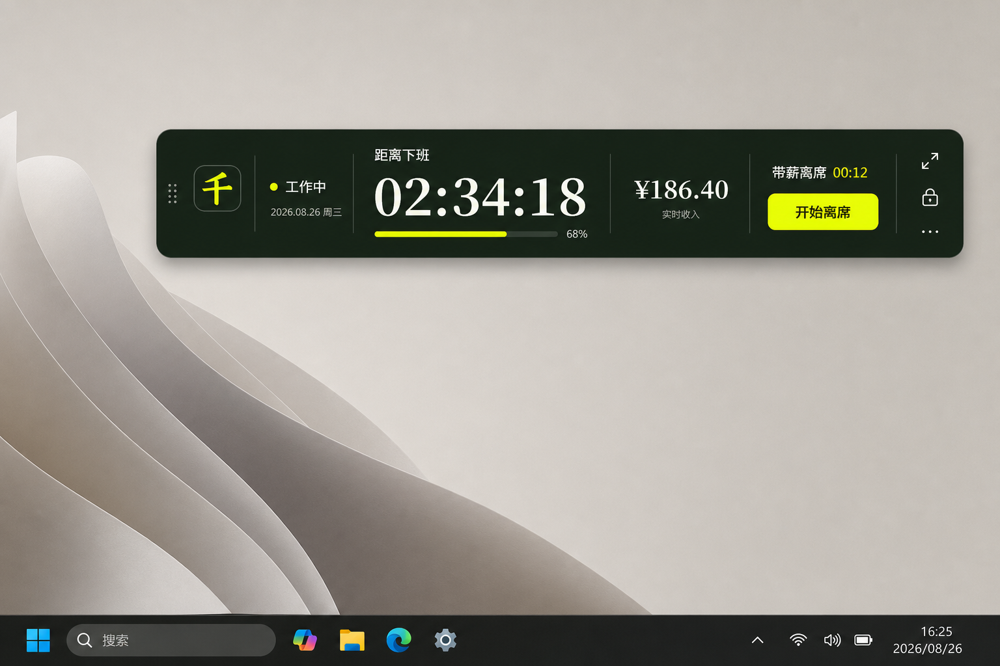
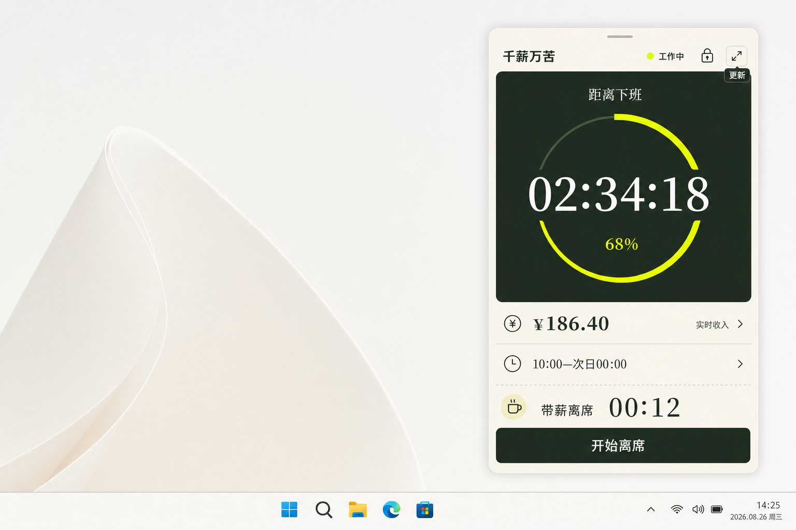
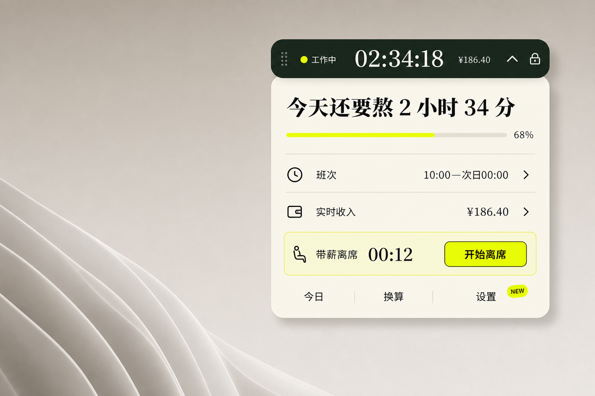

# Windows 桌面挂件交互方案

## 文档入口

- [返回研究索引](index.md)
- [返回文档总索引](../index.md)
- [返回 MAP](../../MAP.md)
- [查看桌面挂件需求](../requirements/desktop-widget/requirements.md)
- [查看 Web/Desktop 开发边界](../development/web-desktop-boundaries.md)
- [查看皮肤系统](../development/desktop-widget-skin-system.md)
- [查看 Windows 桌面挂件执行计划](../exec_plan/windows-desktop-widget-plan.md)

## 评审目标

从三个信息密度和展开方式明显不同的方向中，选定 Windows 第一版挂件的紧凑态形态。三个方向共用以下产品约束：

- 核心优先级是下班倒计时、实时收入、当前班次状态、离席。
- 支持拖动、锁定和展开，并保留安全的恢复入口。
- 沿用现有深森林绿、米白、荧光黄以及编辑感中文字体。
- 日期锚点统一为 2026-08-26，星期三。
- 图片是交互方向评审稿，不代表最终像素、系统图标或窗口 API 已实现。

## 评审结论

2026-08-26 用户选定“极简胶囊加展开面板”作为默认桌面挂件方向，并确认进入开发。小猫上班不作为第四套交互结构，而是同一紧凑挂件能力的可选皮肤；其业务状态、按钮、展开面板和本地数据全部复用默认实现。

## 显示顺序

### 1. 横向信息条



- 适合横向宽屏和屏幕顶部或底部边缘，一眼可同时读完状态、倒计时、收入与离席操作。
- 优点是信息扫描速度最快，拖拽区域和按钮均可持续可见。
- 代价是横向占用较大，在竖屏副屏或窗口密集环境中不够灵活。

### 2. 竖向桌面卡片



- 适合贴屏幕左右边缘，把倒计时进度作为稳定的视觉中心。
- 优点是班次、收入和离席都有清楚分区，常驻阅读最完整。
- 代价是桌面遮挡面积最大，容易逐步膨胀成普通应用窗口。

### 3. 极简胶囊加展开面板



- 常驻时只保留状态、倒计时和收入；单击后，胶囊作为展开面板的固定标题栏。
- 优点是日常占用最小，展开后仍能完成离席、今日、换算和设置操作。
- 代价是收入以外的信息需要多一次点击，折叠、锁定和拖动热区必须避免误触。

## 共同交互约束

- 拖动只能从明确的拖拽热区开始，倒计时、按钮和导航不能触发窗口拖动。
- 锁定后隐藏拖拽反馈，但仍可通过托盘菜单或全局快捷键解锁。
- 展开动作不能暂停计时或改变当前班次状态。
- 开始或结束离席必须提供明确的运行态反馈，避免把一次点击误判为窗口拖动。
- `NEW` 只提示存在未读发布记录，打开后使用左右按钮切换多条更新。
- 关闭语义、默认置顶和鼠标穿透仍按需求文档作为待确认项，不由视觉稿替代产品决策。

## 生成与检查记录

三张图使用内置 ImageGen 独立、顺序生成，并同时附带现有设置页截图与换算页截图作为视觉参考。生成结果在对话中的显示顺序与本文编号一致。

检查结果：

- 三张图均为单一方向，没有把多个候选设计拼在同一张图中。
- 三张图均沿用现有深绿、米白、荧光黄视觉系统。
- 倒计时、收入、班次状态和离席均可识别。
- 日期锚点使用 2026-08-26，星期三。
- 生成图中的中文只用于方案评审；进入实现时必须用真实 HTML 文本和项目图标，不能把整张图作为产品界面。

## 最终生成提示词

### 横向信息条

```text
Use case: ui-mockup
Asset type: Windows desktop widget interaction concept
Primary request: Create one polished interaction direction for the Chinese salary countdown product 千薪万苦: a wide horizontal desktop information bar that stays on the Windows desktop and can be dragged, locked, or expanded. The hero use case is glancing at the time until leaving work while the current shift is in progress. Show only this horizontal-bar direction, not alternative layouts.
Input images: Image 1 is the existing settings UI reference for typography, fields, and restrained monochrome styling. Image 2 is the existing product UI reference for the black-green, off-white, fluorescent-yellow visual language and editorial Chinese typography. Use both as visual grounding, not as edit targets.
Scene/backdrop: a quiet, realistic Windows 11 desktop corner with a soft neutral wallpaper, no browser chrome and no device frame; the widget floats naturally near the upper-right area with a subtle grounded shadow.
Subject: one borderless horizontal widget, approximately 760 x 220 CSS pixels in perceived size. Deep forest-green base, off-white typography, fluorescent-yellow progress and status accents. Clear sections from left to right: small brand mark 千, current state 工作中, dominant countdown 02:34:18 with label 距离下班, real-time income ¥186.40, leave status 离席 00:12, and a compact yellow action button 开始离席. Keep expand, pin/lock, and more controls as three restrained outline icons on the right edge; include a subtle drag-handle region.
Style/medium: realistic production-quality desktop application UI mockup, editorial Chinese product design, restrained brutalist geometry softened by 18px rounding, thin off-white dividers, crisp vector-like icons, excellent alignment and readable type.
Composition/framing: 1536 x 1024 landscape canvas; show a single focused widget at useful inspection scale with generous surrounding desktop context. Do not show a second state, alternate card, settings window, or feature inventory.
Lighting/mood: calm weekday work afternoon, discreet but energetic.
Color palette: #182719 deep forest green, #11150F near-black, #F7F3E8 warm off-white, #EFFF00 fluorescent yellow, muted gray-green.
Text (verbatim): "千" "工作中" "距离下班" "02:34:18" "¥186.40" "离席 00:12" "开始离席"
Date anchor: 2026-08-26, Wednesday. If any date is visible, use "2026.08.26 周三".
Constraints: Chinese text must be legible and spelled exactly; one direction only; hero priority is countdown, income second, leave action third; imply dragging, locking, and expanding through controls without explanatory callouts; readable at Windows desktop scale; no watermark.
Avoid: browser navigation, phone frame, multiple concepts, stacked dashboard cards, charts, fake Windows system notifications, excessive gradients, glassmorphism, neon glow, crowded navigation, English labels, garbled Chinese.
```

### 竖向桌面卡片

```text
Use case: ui-mockup
Asset type: Windows desktop widget interaction concept
Primary request: Create one polished interaction direction for the Chinese salary countdown product 千薪万苦: a tall vertical desktop card that stays near a screen edge and works as a calm personal workday companion. The hero use case is reading the time until leaving work at a glance, with income and paid-leave actions beneath it. Show only this vertical-card direction, not alternative layouts.
Input images: Image 1 is the existing settings UI reference for typography, fields, and restrained monochrome styling. Image 2 is the existing product UI reference for the black-green, off-white, fluorescent-yellow visual language and editorial Chinese typography. Use both as visual grounding, not as edit targets.
Scene/backdrop: a realistic Windows 11 desktop with soft off-white wallpaper, no browser chrome and no device frame; one widget is docked naturally near the right side, leaving generous empty desktop space.
Subject: one borderless vertical widget, approximately 360 x 600 CSS pixels in perceived size. Warm off-white outer surface with a deep forest-green hero area. At top: a slim drag handle, tiny brand 千薪万苦, status dot and 工作中, plus lock and expand icon buttons. Center: dominant countdown 02:34:18 with label 距离下班; fluorescent-yellow 68% workday progress ring or arc integrated around the time. Lower area: real-time income ¥186.40 and shift 10:00—次日00:00 as two lightweight rows, then a clearly separated leave area showing 离席 00:12 and a full-width forest-green button 开始离席. Add a tiny 更新 badge near the expand control without opening a modal.
Style/medium: realistic production-quality desktop application UI mockup, editorial Chinese layout with strong Song-style numerals and restrained sans-serif labels, crisp icons, precise 1px dividers, 22px rounded outer corners, minimal shadow.
Composition/framing: 1536 x 1024 landscape canvas; show one focused vertical widget at useful inspection scale. Do not show another compact state, settings window, multiple cards, dashboards, or feature inventory.
Lighting/mood: calm, thoughtful, premium, useful all day without visual noise.
Color palette: #182719 deep forest green, #11150F near-black, #F7F3E8 warm off-white, #EFFF00 fluorescent yellow, muted gray-green.
Text (verbatim): "千薪万苦" "工作中" "距离下班" "02:34:18" "68%" "¥186.40" "实时收入" "10:00—次日00:00" "离席 00:12" "开始离席" "更新"
Date anchor: 2026-08-26, Wednesday. If any date is visible, use "2026.08.26 周三".
Constraints: Chinese text must be legible and spelled exactly; one direction only; countdown dominates, income and shift are supporting, leave action is unmistakable; controls imply drag, lock, and expand without explanatory callouts; readable at Windows desktop scale; no watermark.
Avoid: browser navigation, phone frame, multiple concepts, card-within-card overload, bottom navigation, charts, fake system notifications, heavy glassmorphism, excessive gradients, neon glow, crowded settings, English labels, garbled Chinese.
```

### 极简胶囊加展开面板

```text
Use case: ui-mockup
Asset type: Windows desktop widget interaction concept
Primary request: Create one polished interaction direction for the Chinese salary countdown product 千薪万苦: an ultra-minimal desktop capsule that expands into a lightweight detail panel. This is one coherent interaction model, shown in its expanded state so the compact capsule remains attached as the panel header. The hero use case is a tiny always-visible countdown; a single click reveals income, shift status, and paid-leave controls. Show only this capsule-plus-panel direction, not alternative layouts.
Input images: Image 1 is the existing settings UI reference for typography, fields, and restrained monochrome styling. Image 2 is the existing product UI reference for the black-green, off-white, fluorescent-yellow visual language and editorial Chinese typography. Use both as visual grounding, not as edit targets.
Scene/backdrop: a realistic Windows 11 desktop corner with a calm warm-gray wallpaper, no browser chrome and no device frame. Place the unified widget near the upper-right edge with generous desktop breathing room.
Subject: one compact pill approximately 430 x 70 CSS pixels in perceived size attached seamlessly to one expanded flyout approximately 430 x 410 CSS pixels. Capsule: deep forest-green surface, tiny fluorescent-yellow status dot, 工作中, dominant compact countdown 02:34:18, small income ¥186.40, chevron-up, and lock icon. Expanded panel directly below in warm off-white with one editorial heading 今天还要熬 2 小时 34 分; a thin fluorescent-yellow work progress bar marked 68%; two clean rows for 班次 10:00—次日00:00 and 实时收入 ¥186.40; a highlighted leave strip showing 离席 00:12 and one yellow button 开始离席. Bottom has only three text actions: 今日, 换算, 设置. Include a tiny drag grip integrated into the capsule and a small NEW dot near the settings action.
Style/medium: realistic production-quality desktop application UI mockup, highly compact editorial Chinese product design, deep green and warm paper surfaces, crisp line icons, strong Song-style countdown numerals, disciplined 12–16px body typography, 18px panel corners, subtle physical shadow.
Composition/framing: 1536 x 1024 landscape canvas; show the single unified capsule-and-expanded-panel interaction at useful inspection scale. The capsule must visually remain the header of the open panel, not appear as a separate alternative. Do not add any other widgets, states, dashboards, or feature inventory.
Lighting/mood: discreet, clever, lightweight, designed to disappear into the desktop until needed.
Color palette: #182719 deep forest green, #11150F near-black, #F7F3E8 warm off-white, #EFFF00 fluorescent yellow, muted gray-green.
Text (verbatim): "工作中" "02:34:18" "¥186.40" "今天还要熬 2 小时 34 分" "68%" "班次 10:00—次日00:00" "实时收入 ¥186.40" "离席 00:12" "开始离席" "今日" "换算" "设置" "NEW"
Date anchor: 2026-08-26, Wednesday. If any date is visible, use "2026.08.26 周三".
Constraints: Chinese text must be legible and spelled exactly; one coherent direction only; compact capsule remains visibly attached to its expanded panel; countdown is primary in compact state, leave action is primary in expanded state; imply drag, lock, collapse, and expand through controls; readable at Windows desktop scale; no watermark.
Avoid: browser navigation, phone frame, two unrelated concepts, disconnected before-and-after panels, card-within-card overload, dashboard grids, charts, fake system notifications, heavy glassmorphism, excessive gradients, neon glow, crowded navigation, English labels except the exact NEW marker, garbled Chinese.
```
